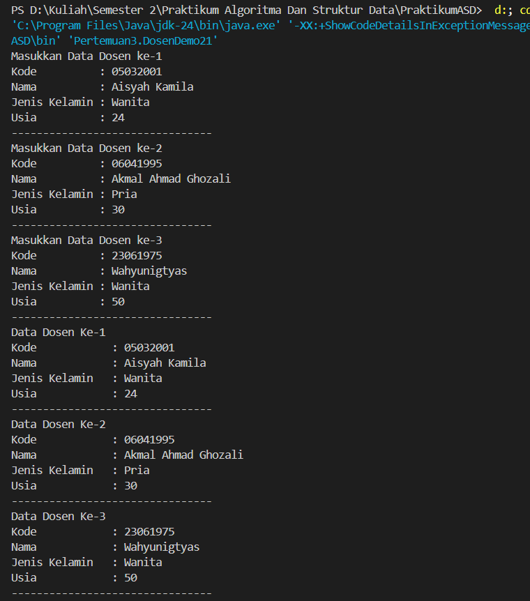

|  | Praktikum Algoritma dan Struktur Data |
|--|--|
| NIM | 25407020237 |
| Nama | Muhammad Akbar Raffi Putra Susanto  |
| Kelas | TI - 1F |
| Repository | [link] https://github.com/254107020237-crypto/PraktikumASD

## JOBSHEET 3

### 3.2 Membuat Array dari Object, Mengisi dan Menampilkan

### 3.2.3 Pertanyaan 

1. Berdasarkan uji coba 3.2, apakah class yang akan dibuat array of object harus selalu memiliki atribut dan sekaligus method? Jelaskan!

    - Tidak, class yang dibuat menjadi array of objects tidak harus memiliki atribut dan method sekaligus.

2. Apa yang dilakukan oleh kode program berikut?

    - Deklarasi dan instansiasi sebuah array of objects.

3. Apakah class Mahasiswa memiliki konstruktor? Jika tidak, kenapa bisa dilakukan pemanggilan konstruktur pada baris program berikut?

    - Memiliki konstruktor, meskipun  tidak menulisnya secara eksplisit di dalam kode.

4. Apa yang dilakukan oleh kode program berikut?

    - Instansiasi objek dan pengisian data pada indeks pertama dari sebuah array of objects.

5. Mengapa class Mahasiswa dan MahasiswaDemo dipisahkan pada uji coba 3.2?

    - Karena, Class Mahasiswa21 berfungsi sebagai Blueprint atau entitas data yang hanya  mendefinisikan struktur. Sementara itu, MahasiswaDemo21 berfungsi sebagai Driver Class yang berisi main method.

### 3.3 Menerima Input Isian Array Menggunakan Looping

### 3.3.3 Pertanyaan

1. Tambahkan method cetakInfo() pada class Mahasiswa kemudian modifikasi kode program pada langkah no 3?

2. Misalkan Anda punya array baru bertipe array of Mahasiswa dengan nama myArrayOfMahasiswa. Mengapa kode berikut menyebabkan error?

    - Karena, NullPointerException mencoba mengisi data ke dalam objek yang belum pernah dibuat.

### 3.4 Constructor Berparameter

###3.4.3 Pertanyaan 

1. Apakah suatu class dapat memiliki lebih dari 1 constructor? Jika iya, berikan contohnya!

2. Tambahkan method tambahData() pada class Matakuliah, kemudian gunakan method tersebut di class MatakuliahDemo untuk menambahkan data Matakuliah?

3. Tambahkan method cetakInfo() pada class Matakuliah, kemudian gunakan method tersebut di class MatakuliahDemo untuk menampilkan data hasil inputan di layar?

4. Modifikasi kode program pada class MatakuliahDemo agar panjang (jumlah elemen) dari array of object Matakuliah ditentukan oleh user melalui input dengan Scanner?

### 3.5 Tugas
1. Buatlah program untuk menampilkan informasi tentang dosen?

2. Tambahkan class baru DataDosen, dengan beberapa method?

A. dataSemuaDosen(Dosen[] arrayOfDosen)untuk menampilkan data semua dosen 

.png)

B. jumlahDosenPerJenisKelamin(Dosen[] arrayOfDosen) untuk menampilkan data jumlah dosen per jenis kelamin (Pria / Wanita)

.png)

C. rerataUsiaDosenPerJenisKelamin(Dosen[] arrayOfDosen) untuk menampilkan rata-rata usia dosen per jenis kelamin (Pria / Wanita) 

.png)

D. infoDosenPalingTua(Dosen[] arrayOfDosen) untuk menampilkan data dosen paling tua

.png)

E. infoDosenPalingMuda(Dosen[] arrayOfDosen) untuk menampilkan data dosen paling muda

.png)

