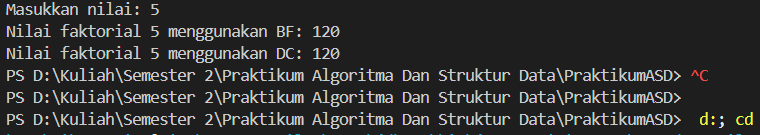
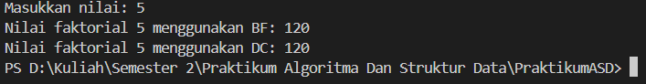
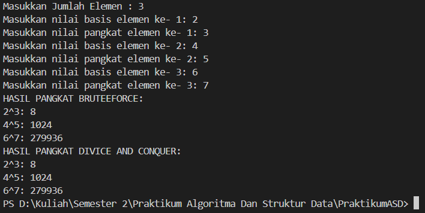
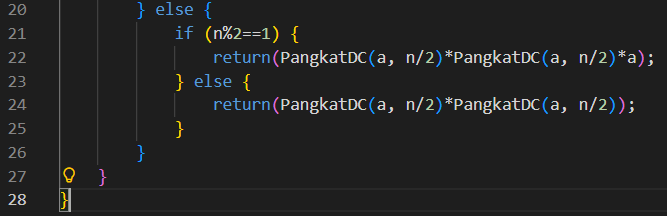
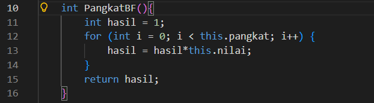
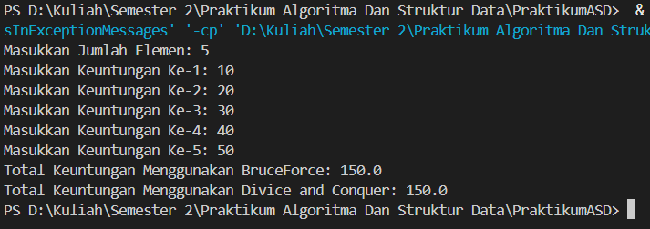
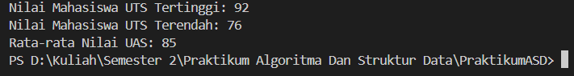

|  | Praktikum Algoritma dan Struktur Data |
|--|--|
| NIM | 25407020237 |
| Nama | Muhammad Akbar Raffi Putra Susanto  |
| Kelas | TI - 1F |
| Repository | [link] https://github.com/254107020237-crypto/PraktikumASD

# Jobsheet 5 Brute Force dan Divide Conquer

## 5.2 Menghitung nilai faktorial dengan algoritma Brufe Force dan Divide Conquer 

## 5.2.3 Pertanyaan

1.  Pada base line Algoritma Divide Conquer untuk melakukan pencarian nilai faktorial, jelaskan perbedaan bagian kode pada penggunaan if dan else?

    - Bagian if program akan terus memanggil dirinya sendiri tanpa henti (infinite loop) hingga menyebabkan Stack Overflow. 
    - Bagian else merupakan langkah rekursif yang menerapkan prinsip divide (memecah masalah nmenjadi n-1) dan combine (mengalikan hasil sub-masalah tersebut dengan n) untuk mencapai solusi akhir.

2. Apakah memungkinkan perulangan pada method faktorialBF() diubah selain menggunakan for? Buktikan!

    

3. Jelaskan perbedaan antara fakto *= i; dan int fakto = n * faktorialDC(n-1); !

    - fakto *= i; adalah metode iteratif yang mengalikan nilai secara langsung di dalam satu variabel, membuatnya lebih efisien memori. Sebaliknya, n * faktorialDC(n-1) adalah metode rekursif yang menunda perkalian dengan menumpuk pemanggilan fungsi di memori sampai mencapai kondisi berhenti. Intinya, iteratif seperti menghitung di satu kertas, sedangkan rekursif seperti menuliskan deretan tugas yang baru diselesaikan berantai di akhir.

4. Buat Kesimpulan tentang perbedaan cara kerja method faktorialBF() dan faktorialDC()?

    - faktorialBF() bekerja secara iteratif, yaitu langsung menghitung nilai dengan perulangan di satu variabel yang sama, sehingga jauh lebih hemat memori. Sementara itu, faktorialDC() bekerja secara rekursif, yaitu memecah masalah menjadi tumpukan pemanggilan fungsi yang saling bergantung, yang meski terlihat elegan secara matematis, lebih boros memori karena setiap langkah harus disimpan dalam tumpukan (stack) sampai mencapai titik henti.

## 5.3 Menghitung hasil pangkat dengan algoritma brufe force dan divide and conquer

### 5.3.3 Pertanyaan 

1. Jelaskan mengenai perbedaan 2 method yang dibuat yaitu pangkatBF() dan pangkatDC()?

    - PangkatBF adalah metode "tambah satu persatu" yang sederhana namun lambat untuk angka besar, sedangkan PangkatDC adalah metode "memecah masalah" yang jauh lebih  cepat karena memangkas jumlah langkah yang diperlukan.

2. Apakah tahap combine sudah termasuk dalam kode tersebut?Tunjukkan!

    

3. seperti apa method pangkatBF() yang tanpa parameter?

    

4. Tarik tentang cara kerja method pangkatBF() dan pangkatDC()!

    - Brute Force (pangkatBF) menghitung secara linear dengan mengalikan basis satu per satu, sedangkan Divide and Conquer (pangkatDC) bekerja jauh lebih cepat  dengan memecah pangkat menjadi setengahnya secara rekursif sehingga memangkas jumlah operasi perkalian secara signifikan.

## 5.4 Menghitung sum array dengan algoritma brufe force dan divide and conquer

### 5.4.3 Pertanyaan 

1. Kenapa dibutuhkan variable mid pada method TotalDC()?

    - Berfungsi sebagai titik tengah untuk membagi array menjadi dua bagian seimbang agar masalah dapat diselesaikan secara rekursif. Dengan menentukan batas mid, algoritma dapat memproses sub-array kiri dan kanan secara terpisah hingga mencapai elemen tunggal, yang kemudian dijumlahkan kembali, sehingga memastikan kedalaman rekursi tetap efisien.

2. Untuk apakah statement di bawah ini dilakukan dalam TotalDC()?

    - Masalah besar dipecah menjadi dua sub-masalah yang lebih kecil untuk diselesaikan secara rekursif. lsum bertugas memproses setengah bagian kiri array, sementara rsum memproses setengah bagian kanan. 

3.  Kenapa diperlukan penjumlahan hasil lsum dan rsum seperti di bawah ini?

    - Untuk menggabungkan kembali untuk mendapatkan total keseluruhan.

4. Apakah base case dari totalDC()?

    - Base case dari totalDC() adalah kondisi if (l == r), yang tercapai saat cakupan array hanya menyisakan satu elemen. Pada titik ini, fungsi langsung mengembalikan nilai elemen tersebut (return arr[l]) sebagai hasil perhitungan dasar, yang kemudian menjadi penghenti rekursi.

5. Tarik Kesimpulan tentang cara kerja totalDC()?

    - totalDC() bekerja dengan membagi array secara rekursif menggunakan titik tengah hingga mencapai base case yang merupakan elemen tunggal. Setelah mencapai elemen tunggal tersebut, nilai dikembalikan ke level rekursi sebelumnya dan dijumlahkan (lsum + rsum) secara bertahap hingga seluruh elemen array terhitung.

## 4.5 Latihan 

